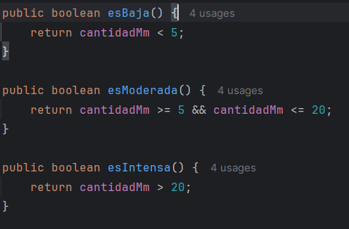
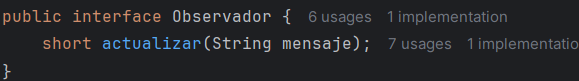

# Primer Sprint: Estrategia de validación de pruebas, stubs y fakes (8 puntos)

## Problema
Estás encargado de desarrollar y probar un sistema que desencadena eventos avanzados basados en
combinaciones complejas de condiciones booleanas externas relacionadas con el clima. Este sistema
debe ser diseñado de manera limpia, siguiendo principios de diseño como responsabilidad única,
código limpio y TDD.

El proyecto se desarrollará en dos sprints, donde se aplicarán técnicas de validación de pruebas,
refactorización y contenerización utilizando Docker.
## Entradas y salidas del sistema
### Entrada
El sistema recibe un conjunto de condiciones climáticas externas como entrada. Estas condiciones
pueden incluir:
- Temperatura (en grados Celsius)
- Cantidad de Lluvia (en mm)
- Velocidad del Viento (en km/h)
- Humedad (en porcentaje)
- Presión Atmosférica (en hPa)

Cada una de estas condiciones será evaluada para determinar si se cumplen ciertos criterios
booleanos que desencadenan eventos específicos.
## Salida
El sistema genera eventos basados en las combinaciones de las condiciones climáticas evaluadas. Las
salidas pueden ser:
- Alertas (Alerta de Lluvia Intensa, Alerta de Viento Fuerte)
- Acciones automáticas (Activar Sistema de Riego, Cerrar Persianas)
- Notificaciones (Enviar Notificación a Usuarios)

Las salidas deben estar claramente definidas y documentadas en función de las combinaciones
específicas de condiciones climáticas.

## Objetivos
- Desarrollo inicial del sistema: Crear el sistema con un diseño limpio y clases con
responsabilidad única.
- Implementación de TDD: Utilizar el desarrollo dirigido por pruebas (TDD) para asegurar que
cada componente cumpla con su responsabilidad.
- Estrategia de validación de pruebas: Definir y aplicar una estrategia de validación que
incluya stubs y fakes para simular las condiciones climáticas externas.
- Refactorización y código limpio: Asegurar que el código sea limpio y fácil de mantener
mediante la refactorización continua.
- Métricas de calidad: Establecer métricas de calidad para evaluar la cobertura de pruebas y la
complejidad del código.
## Actividades
1. Diseño y implementación inicial:
    - Diseñar las clases responsables de manejar las condiciones climáticas (Temperatura,
    Lluvia, Viento).
        
    - Implementar estas clases asegurando que cada una tenga una única responsabilidad.

        - Temperatura
            
        - Lluvia
            
        - Viento
            
2. Desarrollo con TDD:
    - Escribir pruebas unitarias para cada clase antes de implementar la funcionalidad.
        - Temperatura
            
        - Lluvia
            
        - Viento 
            
    - Implementar la funcionalidad necesaria para que las pruebas pasen.
        - Temperatura
            
        - Lluvia
            
        - Viento 
            
    - Refactorizar el código después de que las pruebas pasen para mantenerlo limpio.
3. Validación de pruebas con stubs y fakes:
    - Crear stubs para simular las condiciones climáticas
        - StubViento
            
        - StubLLuvia
            
        - StubTemperatura
            

    - Implementar fakes para simular escenarios de prueba más complejos
        
4. Refactorización y código limpio:
    - Refactorizar el código regularmente para mejorar la legibilidad y mantenibilidad.

    - Aplicar principios de diseño limpio y patrones de diseño adecuados.

        - SRP: Cada clase tiene una única responsabilidad.
            - Lluvia
                
            - Temperatura
                
            - Viento
                

        - Patrón de Factory: Para la creación de objetos CondicionClimatica.
            
        - Patrón Observer: Para notificar alertas cuando se cumplen ciertas condiciones.
            - Observador
                
            - Alerta
                
            - SistemaClimatico
                

5. Métricas de calidad:
    - Utilizar herramientas para medir la cobertura de pruebas (Jacoco)
        - Configuracion de Jacoco:
            
        - Resultado de la prueba:
            
    - Evaluar la complejidad del código utilizando métricas como la complejidad
    ciclomática.

## Entregables
- Código fuente inicial del sistema con clases bien diseñadas.
- Conjunto de pruebas unitarias y de integración utilizando stubs y fakes.
- Métricas de cobertura de pruebas y complejidad del código.

